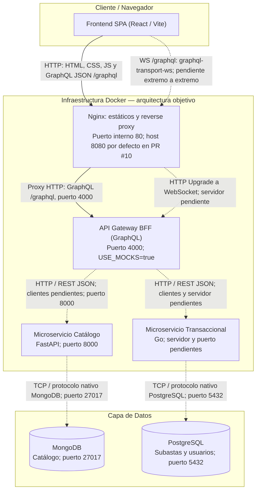

# Vista de Arquitectura: Componentes y Conectores (C&C) - Pujaz

## Descripción

Esta vista documenta los componentes en tiempo de ejecución del sistema de subastas
**Pujaz** y sus conectores y protocolos. Representa la arquitectura objetivo y
explicita las conexiones todavía pendientes de implementación o integración.

Referencia de implementación: `developcito` en `c78871e`. La infraestructura de
KAN-7, KAN-36 y KAN-49 se entrega por separado en el [PR #10](https://github.com/heider88/Pujaz/pull/10);
no está incluida en esta base. Esta documentación no incorpora sus archivos.

## Diagrama C&C

Las líneas continuas describen el flujo HTTP del prototipo de infraestructura del
PR #10. Las discontinuas indican conexiones previstas todavía no operativas.
No representan un despliegue completo disponible en el commit base de esta vista.

## Componentes y Conectores

### Componentes

- **Frontend SPA:** Aplicación React compilada por Vite y ejecutada en el navegador.
  Utiliza `/graphql` relativo al origen; el navegador no usa nombres internos Docker.
- **Nginx:** Sirve los archivos compilados, aplica fallback a `/index.html` y actúa
  como punto de entrada único del prototipo del PR #10. Escucha en el puerto 80 del
  contenedor, publicado por defecto como 8080 en el host (`NGINX_PORT`).
- **API Gateway BFF:** Expone el esquema GraphQL y valida JWT. Escucha por defecto
  en 4000 (`PORT`). Actualmente utiliza clientes simulados en memoria.
- **Microservicio Catálogo:** FastAPI/Python en 8000. Actualmente expone `/` y
  `/api/articulos` con datos fijos; el contrato objetivo define `/items` y sus variantes.
- **Microservicio Transaccional:** Componente previsto en Go para subastas, pujas y
  usuarios. Existen migraciones y pruebas, pero no un servidor ejecutable ni un puerto acordado.
- **Bases de datos:** MongoDB para catálogo y PostgreSQL para datos transaccionales,
  siguiendo el principio de una base por servicio. El Gateway no accede directamente a ellas.

### Conectores y protocolos

| Origen → destino | Protocolo, ruta y puerto | Estado y responsabilidad |
|---|---|---|
| Navegador → Nginx | HTTP: estáticos y GraphQL JSON en `/graphql`; host 8080 → contenedor 80 en PR #10 | Un mismo origen para SPA y API. Las consultas GraphQL no son REST. |
| Nginx → Gateway | HTTP, `/graphql`, puerto 4000 por defecto | Conserva método, cuerpo, query string y `Authorization: Bearer <JWT>`. |
| Navegador → Nginx → Gateway | WebSocket sobre `/graphql`; biblioteca `graphql-ws`, subprotocolo `graphql-transport-ws` | Nginx prepara `Upgrade` y `Connection`; faltan servidor WebSocket y resolvers en Gateway. |
| Gateway → Catálogo | HTTP / REST JSON, puerto 8000; `/items` según contrato | Faltan clientes HTTP del Gateway y endpoints completos del catálogo. |
| Gateway → Transaccional | HTTP / REST JSON; puerto pendiente; `/users`, `/auctions` y demás rutas del contrato | Faltan clientes HTTP y servidor transaccional. |
| Catálogo → MongoDB | TCP con protocolo nativo MongoDB, puerto 27017 | Previsto; el catálogo todavía devuelve datos fijos. |
| Transaccional → PostgreSQL | TCP con protocolo nativo PostgreSQL, puerto 5432 | Previsto para el servidor; las migraciones y pruebas existentes usan PostgreSQL. |

El laboratorio usa **HTTP y WS**, sin terminación TLS implementada. **HTTPS y WSS**
corresponden a un despliegue futuro con TLS configurado; no se presentan como activos.
TLS en el acceso público tampoco implica TLS en el enlace interno Nginx → Gateway.

## Configuración, seguridad y estado de integración

- En el prototipo del PR #10, CORS lo gestiona el Gateway con `CORS_ORIGIN` igual al
  origen público de la SPA; Nginx no duplica las cabeceras. En desarrollo local,
  Vite redirige `/graphql` a `localhost:4000` y se permite `http://localhost:5173`.
- `JWT_SECRET` se suministra exclusivamente al Gateway; nunca forma parte del
  frontend, sus archivos compilados o la configuración de Nginx. El navegador
  transmite el token, no la clave de firma.
- `USE_MOCKS=true` permite probar SPA → Nginx → Gateway sin esperar a otros servicios.
  No implica comunicación real del Gateway con catálogo o transaccional.
- El Compose del commit base solo incluye PostgreSQL, MongoDB y catálogo, con
  puertos publicados 5432, 27017 y 8000. El PR #10 propone redes `public`, `backend`
  y `data`, un único puerto público en Nginx y volúmenes nombrados para ambas bases.
- El paso de cabeceras WebSocket no equivale a suscripciones funcionales:
  `auctionUpdated` está definido en el esquema, pero su ejecución está pendiente.

## Contratos de referencia

- [Esquema GraphQL y suscripción auctionUpdated](contrato/schema.graphql).
- [Contrato REST entre Gateway y microservicios](contrato/rest.md).
- [Estado de implementación del Gateway](../gateway-bff/README.md).
- [Compose del repositorio](../docker-compose.yml).
